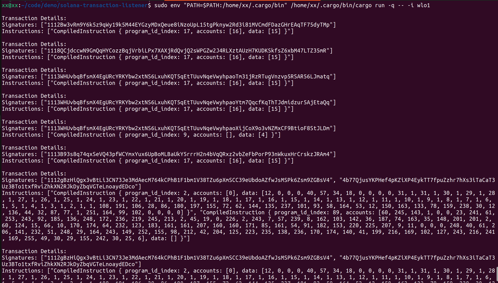

# Solana Transaction Listener - Network Layer

This is a rust implementation for listening to Solana transactions on the network layer. It uses the port level upd protocol to listen to the transactions on port 8001. The transaction listener listens to the transactions and prints the transaction details to the terminal as well as in a debug.log file.

## Installation

Before running the transaction listener, you need to install the rust toolchain. You can install the rust toolchain on linux by running the following command:

```bash
curl --proto '=https' --tlsv1.2 -sSf https://sh.rustup.rs | sh
```

For more follow the official rust installation guide [here](https://www.rust-lang.org/tools/install).

After you have installed the rust toolchain, you should install the solana toolchain. You can install the solana toolchain by running the following command:

```bash
sh -c "$(curl -sSfL https://release.solana.com/v1.18.15/install)"

```

You require the Solana toolchain so that you can run the Solana node in gossip mode.

Finally, if you need to run the transaction listener using binary file, you can run the following command:

```bash
sudo cargo build --release
```

This will create a binary file in the target/release directory.

## Usage

This tool listens to the transactions on the network layer provided the host is running the Solana node at least in gossip mode.

You can kick off the Solana node in gossip mode by running the following command:

```bash
~/.local/share/solana/install/releases/1.18.14/solana-release/bin/solana-gossip spy --entrypoint entrypoint.devnet.solana.com:8001
```

To run the transaction listener, you can choose to run the binary file or run the rust code directly.

To run the binary file, you can run the following command:

```bash
sudo ./target/release/solana-transaction-listener -i <interface>
```

To run the rust code directly, you can run the following command:

```bash
sudo cargo run -- -i <interface>
```

Replace `<interface>` with the network interface you want to listen to. We need sudo permissions to listen to the network traffic as network interface if often a privileged operation.

While running the transaction listener, you can see the transaction details in the terminal as well as in the debug.log (+WARN and INFO) file.

## Testing

To test the transaction listener, you can run the following command:

```bash
sudo cargo test -- --nocapture
```

There are currently two unit tests in the test suite. The first test checks if the transaction listener can listen to the network traffic using a preexisting pcap file. The second test checks if the transaction listener can listen to the network traffic using a custom made udp packet.

## Sample Output



## License

[MIT](https://choosealicense.com/licenses/mit/)
